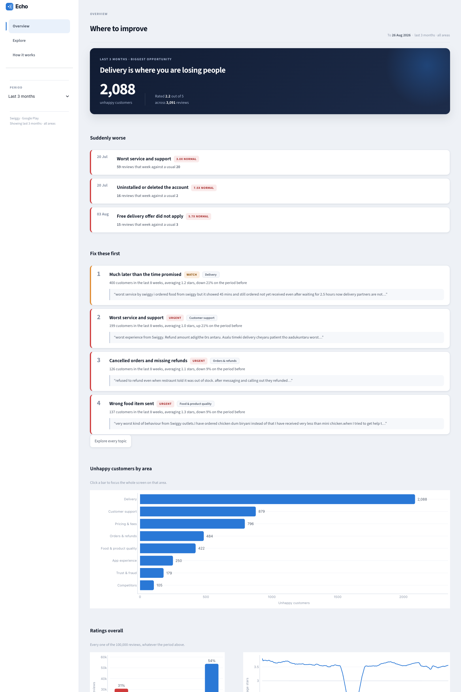
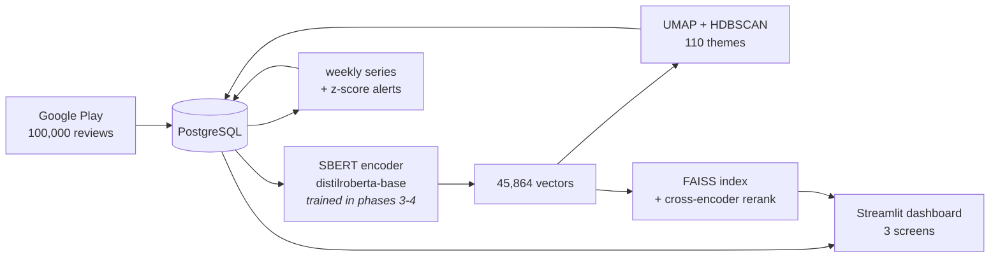

# Echo — customer feedback intelligence from app reviews

**100,000 Swiggy reviews go in. What to fix first comes out.**

Echo reads app-store reviews, groups them by *meaning* rather than by keyword, and tells a
business team which problems are biggest, which are growing, and which spiked last week. The
sentence-embedding model underneath is trained from scratch, reproducing
[Sentence-BERT (Reimers & Gurevych, 2019)](https://arxiv.org/abs/1908.10084).



---

## The problem

A food-delivery app collects thousands of reviews a week. Somewhere in them is the answer to
"what should we fix?" — but nobody can read them all, and keyword counting cannot find it,
because customers describe one problem in many ways:

> "app keeps crashing" · "closes by itself" · "shuts down when I open it"

Three phrasings, one bug, zero shared keywords. A search for *crash* finds the first and misses
the other two. That is the gap this project closes.

## What Echo answers

| Question a growth team asks | Where Echo answers it |
|---|---|
| What is hurting us most right now? | **Overview** — a ranked list, each with a real customer quote |
| Which part of the business is worst? | **Overview** — click any area to focus the whole screen on it |
| Did something break last week? | **Overview** — volume spikes against each topic's own normal range |
| What are customers actually talking about? | **Explore** — 110 topics found in the reviews themselves |
| Is this one getting worse? | **Explore** — click a topic for its week-by-week history and its reviews |
| "What do people say about refunds?" | **Explore** — search finds paraphrases, not just the word *refund* |

Two findings the system surfaced that keyword counting would not have:

- **"Surge fee charged in the rain" is up 453%** — a complaint that never says the word "surge"
- **Delivery accounts for 2,088 of the period's unhappy customers**, rated 2.2 out of 5

---

## Results at a glance

| What was measured | Result | Beats |
|---|---|---|
| Sentence-BERT reproduction (STS average) | **72.17** | paper's 74.21, on 32% of its training data |
| After domain adaptation | **74.54** | a different recipe — see [reproduction notes](#reproducing-the-paper) |
| Review search, my trained model alone | 61.15 | **loses** to TF-IDF's 65.00 |
| Review search, + off-the-shelf reranker | **75.77** | TF-IDF's 65.00 — the only configuration that wins |
| Theme assignment, blind hand-audit | **82.4%** | averaged GloVe's 44.1% (p = 0.0022); *not* separated from plain BERT (p = 0.56) |
| Search latency, p50 | **8.1 ms** | across 45,864 reviews |

Every number above is produced by a script in [`eval/`](eval/) and written to
[`results/`](results/), and `python -m eval.check_readme` asserts this file still
matches them. None is hand-copied.

**Read the search rows together.** The bi-encoder trained here scores 61.15 and loses to keyword
search. The 75.77 comes from putting a *pretrained, not-trained-here* cross-encoder
(`ms-marco-MiniLM-L-6-v2`) in front of it. Domain adaptation closed 80% of the gap to TF-IDF and
improved generic STS at the same time; it did not close all of it. That is the honest headline,
and it is stated here rather than left in the limitations section.

---

## How it works



Four stages, each measured before the next was built:

1. **Collect** — `google-play-scraper` into PostgreSQL. 100,000 reviews, 220 days.
2. **Train** — a siamese network written by hand in raw PyTorch on 300,000 SNLI + MultiNLI
   pairs, then adapted to Swiggy's own language with `MultipleNegativesRankingLoss`.
3. **Derive** — cluster the corpus into themes; build a search index; detect weekly spikes.
4. **Serve** — a Streamlit dashboard for a business team, not for a data scientist.
   Three screens, and the charts are clickable: selecting a bar filters the screen
   rather than opening a dropdown, so every interaction added removes a control.

---

## Reproducing the paper

The point of the project was to build the model, not to import it. Phase 3 imports
`sentence-transformers` nowhere — the siamese training loop, the pooling, and the
`(u, v, |u−v|)` classifier head are written directly in PyTorch.

### Table 1 — STS benchmarks (Spearman × 100)

| | STS12 | STS13 | STS14 | STS15 | STS16 | STS-B | SICK-R | **Avg** |
|---|---|---|---|---|---|---|---|---|
| Avg. GloVe (ours) | 57.25 | 53.79 | 52.00 | 59.70 | 49.83 | 47.37 | 57.21 | 53.88 |
| Avg. GloVe (paper) | 55.14 | 70.66 | 59.73 | 68.25 | 63.66 | 58.02 | 53.76 | 61.32 |
| Avg. BERT (ours) | 30.87 | 59.89 | 47.73 | 60.29 | 63.73 | 47.29 | 58.65 | 52.64 |
| Avg. BERT (paper) | 38.78 | 57.98 | 57.98 | 63.15 | 61.06 | 46.35 | 58.40 | 54.81 |
| BERT CLS (ours) | 21.54 | 32.11 | 21.28 | 37.89 | 44.24 | 20.30 | 42.74 | 31.44 |
| BERT CLS (paper) | 20.16 | 30.01 | 20.09 | 36.88 | 38.08 | 16.50 | 42.63 | 29.19 |
| **SBERT distilroberta 300k (ours)** | 67.20 | **73.71** | 69.11 | 75.58 | 72.35 | 75.60 | 71.63 | **72.17** |
| SRoBERTa-NLI-base (paper) | 71.54 | 72.49 | 70.80 | 78.74 | 73.69 | 77.77 | 74.46 | 74.21 |

**72.17 against the paper's 74.21 — a 2.04 point gap, on 32% of the training data.** We exceed
the paper on STS13 (+1.22).

### Was the gap a bug, or the smaller subset?

Checked before concluding, all reproducible with `python -m eval.diagnostics`:

| check | result |
|---|---|
| Step-1 loss vs theoretical ln(3) = 1.0986 | 1.0901 |
| Loop can memorise 192 pairs in 40 epochs | loss 0.0011, accuracy 1.00 |
| One shared encoder, not two | params total == encoder + head, exactly |
| Pooling ignores padding | pass |
| Trained weights actually saved | 101/103 tensors changed |

The decisive evidence is the scaling curve — performance still climbing at every point measured
is what a *data-limited* result looks like, where a bug would give a flat line well below target:

| training pairs | STS avg |
|---|---|
| 0 (untrained control) | 49.58 |
| 50,000 @ 2e-5 | 44.83 |
| 50,000 @ 5e-5 | 49.14 |
| 150,000 @ 2e-5 | 50.53 |

Two things fell out of that curve worth keeping. **Partial NLI training is worse than none** — at
50k pairs the model scored *below* an untrained control, because fine-tuning first disturbs the
geometry pretraining produced and only rebuilds something better once there is enough signal. A
reproduction that stopped at 50k would have concluded the method does not work. And **the paper's
2e-5 is tuned for `bert-base`**; on a quarter-size model it was too low, and 5e-5 recovered 4.3
of the 4.75 lost points.

### Where our comparison flatters us, and by how much

**Our GloVe baseline is 7.4 points below the paper's (53.88 vs 61.32), and that inflates our
apparent margin.** We beat our own GloVe by +18.29; the paper beats its GloVe by +12.89. The
extra ~5 points are our baseline being weak, not our model being strong.

The cause is an aggregation choice: we compute one Spearman over all pairs, while SentEval —
which the paper used — scores each sub-dataset separately and averages. Measured directly on
STS-B with GloVe: 44.11 pooled vs 50.07 per-subset. Our BERT rows sit much closer to the
paper's, which is why the harness itself is not suspect. **When quoting an improvement over
GloVe, use the paper's margin as the sanity check, not ours.**

### Table 6 — the architecture ablation

Nine runs, 100,000 pairs each, scored on STS-B. Absolute scores sit 7–17 points below the paper
at this scale; the ordering is what is being tested.

| claim | paper | ours | verdict |
|---|---|---|---|
| `\|u−v\|` is the critical component | +14.74 | **+15.20** | **holds** |
| Adding `u*v` hurts | −0.34 | **+2.75** | **does not hold** |
| Mean pooling beats max and CLS | mean wins | mean wins | holds |

On the first claim the separation is total: **every configuration containing `|u−v|` scores
62.22–70.93, every configuration without it 52.98–60.38. The two groups do not overlap.**

On the second, we find `u*v` clearly helpful where the paper finds it slightly harmful. Our
effect is eight times the size of theirs and points the other way, so it is not simply noise.
The likely explanation — a hypothesis, not a measurement — is that at 100k pairs the model is
undertrained and still benefits from richer input features. **One seed per configuration means
run-to-run variance cannot be fully excluded**, so this is reported as a finding to explain, not
a correction to the paper.

---

## Full results

### Review retrieval — 26 hand-judged queries, 1,054 judgements

| system | Recall@10 | Precision@10 | MRR |
|---|---|---|---|
| TF-IDF | 30.69 | 65.00 | 85.71 |
| Averaged GloVe | 23.17 | 58.85 | 78.22 |
| Mean-pooled BERT | 17.25 | 43.46 | 74.27 |
| SBERT, NLI only (Phase 3) | 17.72 | 45.77 | 72.25 |
| SBERT, domain-adapted (Phase 4) | 24.08 | 61.15 | 83.81 |
| FAISS IVF, nprobe=10 | 20.85 | 53.08 | 83.80 |
| **FAISS top-50 + cross-encoder** | **30.64** | **75.77** | **86.54** |

Recall@10 has a ceiling of **49.78** here — with a median of 16 relevant reviews per query, they
cannot all fit in a top-10.

**Two evaluation traps were hit and corrected, and both are the interesting part.** The first
time a trained model was scored it returned Precision@10 of 11.54 — because only 13.8% of its
results had ever been shown to a human, and the scorer counts anything unjudged as wrong. The
pool had been built from three *lexical* systems, so the reviews a meaning-based model finds were
exactly the ones nobody had looked at. The reranker later hit the same trap and appeared to make
results *worse* (40.77) at 47.3% coverage. Both were fixed by re-pooling and judging the new
candidates; coverage is now 96.2% for every neural system.

Precision@10 stayed identical to the decimal for every previously-measured system across both
pool revisions, while Recall fell for all of them as more relevant reviews entered the
denominator. **Precision is the metric to quote while a test collection is still growing; recall
is not comparable across pool revisions.**

### Theme quality — same pipeline, three embeddings

| model | themes | noise % | biggest theme | silhouette | blind audit |
|---|---|---|---|---|---|
| Averaged GloVe | 47 | **15.04** | **58.64%** | −0.033 | 44.1% |
| Mean-pooled BERT | 42 | 25.45 | 41.15% | 0.050 | 73.5% |
| **SBERT domain-adapted** | **110** | 40.30 | **5.88%** | **0.114** | **82.4%** |

**The most flattering-looking metric ranks the worst model first.** GloVe posts the best noise
figure by refusing to separate anything — its largest cluster holds 58.6% of the corpus and mixes
5-star praise with 1-star rants. `largest_pct` was added to the comparison output specifically so
that cannot be read past. Silhouette is computed inside each model's own space and is a tuning
diagnostic, not a cross-model comparison.

The audit was blind: 102 judgements, model names never rendered (verified with
`streamlit.testing.v1`), sample drawn deterministically so it cannot be redrawn until it flatters
someone.

| comparison | Fisher exact p | verdict |
|---|---|---|
| SBERT vs GloVe | 0.0022 | **significant** |
| BERT vs GloVe | 0.0258 | **significant** |
| **SBERT vs mean-pooled BERT** | **0.5597** | **NOT significant** |

**The 8.8-point lead over plain BERT is not statistically established** at 34 judgements per
model and is not claimed as one. The case for the trained model rests instead on structure: 110
themes against 42, and 5.88% of the corpus in the largest theme against 41.15%. A theme holding
41% of all reviews is not something a product manager can act on, whatever its audit score.

### Search latency — p50/p95 over 200 queries, full corpus

| stage | p50 ms | p95 ms |
|---|---|---|
| Query encode (bi-encoder, MPS) | 6.57 | 15.69 |
| FAISS exact search | 1.46 | 1.98 |
| FAISS IVF search | 0.18 | 0.52 |
| Cross-encode 50 candidates | 58.65 | 177.15 |
| **Total, single-stage** | **8.11** | **17.51** |
| **Total, two-stage** | **68.63** | **192.57** |

Reranking costs **8.5x the latency for +14.62 Precision@10**, and 69 ms is still comfortably
interactive, so the trade is worth taking.

Two honest observations. **FAISS is not the bottleneck** — exhaustive search over 45,864 vectors
takes 1.46 ms while encoding the query takes 6.57 ms. And **the approximate index is not needed
at this scale**: IVF saves 1.3 ms and costs 8.07 Precision@10. Approximate indexes earn their
place at millions of vectors; claiming ANN was "needed" here would be false.

### Why not cross-encode all 45,864 reviews?

A **bi-encoder** passes the query and each review through the model *separately*, so all 45,864
review vectors are computed once, offline, and a query costs one forward pass plus a matrix
multiply. A **cross-encoder** passes query and review through BERT *together*, so every layer
attends across both — more accurate, but it precomputes nothing, so ranking the corpus means
45,864 forward passes **per query**.

At the measured rate (50 candidates in 58.65 ms), scoring the whole corpus would take roughly
**54 seconds per query**, against 8.11 ms — about 6,600x. That is the Sentence-BERT paper's
opening argument reproduced on this corpus. Two-stage search uses each where it is strong: the
bi-encoder cheaply narrows 45,864 to 50 (a recall job), the cross-encoder carefully orders those
50 (a precision job, on a set small enough to afford).

---

## What this is worth in analyst hours

Every assumption below is stated so it can be argued with. The estimate is deliberately
conservative, and the honest answer is a **range, not a number**.

**Assumptions**

| # | Assumption | Value | Confidence |
|---|---|---|---|
| 1 | Review volume | ~13,800/month (100,000 over 220 days) | measured |
| 2 | An analyst hand-tags short reviews at | 250/hour | **weakest assumption** — not measured here |
| 3 | A manual monthly themes report samples | 500 reviews | plausible, not measured |
| 4 | Ad-hoc "what do people say about X" questions | 5/week | **assumption doing most of the work** |
| 5 | Answering one by keyword search + reading | 20 min | not measured |
| 6 | Answering one with Echo's search | 2 min | measured at 8 ms + reading time |
| 7 | Themes still need spot-checking at 82.4% accuracy | 100 checks/month | follows from the audit |
| 8 | Working weeks per year | 45 | — |

**Estimate**

| Task | Manual | With Echo | Saved |
|---|---|---|---|
| Monthly themes report | 2.0 h (500 ÷ 250) | 0.4 h (100 spot-checks) | 1.6 h/month → **19 h/yr** |
| Ad-hoc questions | 1.7 h/week (5 × 20 min) | 0.2 h/week | 1.5 h/week → **68 h/yr** |
| | | | **≈ 87 h/yr** |

**Roughly 87 analyst-hours a year — about two working weeks.** Vary assumption 4 between 3 and
10 questions a week and the total moves between **60 and 155 hours**, which is the honest width
of this estimate.

**What this figure does not claim.** It is not a revenue number; nothing here measures whether
fixing a complaint retains a customer. It does not claim Echo replaces an analyst — it removes
the mechanical part of reading and tagging, and at 82.4% theme accuracy roughly one assignment in
six is wrong, so a human still has to look. And it assumes the team asks these questions at all;
if nobody currently does this work by hand, the saving is zero and the value is in questions that
were never asked because they were too expensive.

**One thing the latency number does *not* buy.** 8 ms versus 100 ms is imperceptible to a person
and saves nobody any time. Latency matters here for the dashboard feeling responsive, and because
it is what makes cross-encoder reranking affordable at all. **The time saving comes from finding
paraphrases, not from speed** — from returning "closes by itself" when you searched for "crash".

---

## Running it

Requires **Python 3.11** and a local **PostgreSQL**. Trained on Apple Silicon (`mps`); training
runs used a Kaggle T4.

```bash
git clone git@github.com:ayn-aval/Echo.git && cd Echo
python3.11 -m venv venv && source venv/bin/activate
pip install -r requirements-dev.txt     # runtime + training, scraping, evaluation
cp .env.example .env                    # then fill in your Postgres credentials

python -m src.db.init_db    # create every table
```

Then either point it at existing data, or rebuild the pipeline end to end:

```bash
python -m src.ingest.scrape_play --app swiggy      # scrape into Postgres; resumable
python -m src.ingest.clean                         # word counts, language tags, keep flags
python -m src.embeddings.encode_corpus             # encode with the trained model (MPS)
python -m src.clustering.name_themes --model sbert-domain   # discover and label themes
python -m src.clustering.theme_names               # apply readable names to all 110
python -m src.clustering.theme_categories          # roll them up to 8 business areas
python -m src.search.index                         # build the FAISS indexes
python -m src.analytics.weekly                     # weekly series per theme
python -m src.analytics.alerts                     # spike detection

streamlit run app/main.py                          # the dashboard
```

Encoding is the long step: **184 texts/second on Apple Silicon (`mps`)**, so about 4 minutes for
45,864 distinct texts — measured on a 2,048-text sample after warm-up, not on the full run.
Everything else takes seconds to low minutes.

Training (GPU, not needed to run the app) is in [`notebooks/`](notebooks/):
`phase3_train_sbert.ipynb` then `phase4_domain_adapt_kaggle.ipynb`.

**Two requirements files.** `requirements.txt` is what the dashboard needs to
*run* — 13 packages. `requirements-dev.txt` adds the nine that only training,
scraping, clustering and evaluation use (`umap-learn`, `hdbscan`, `datasets`,
`matplotlib` and so on). The split exists because the deployed server installs
the plain file, and there is no reason to build UMAP on a machine that only
serves a dashboard.

**The app runs without any local model files.** When `models/` and `data/` are
absent it pulls the encoder and vectors from the Hugging Face Hub
([model](https://huggingface.co/aynaval2003/echo-sbert-domain),
[vectors](https://huggingface.co/datasets/aynaval2003/echo-review-vectors)) and
builds the FAISS index in memory — local files win whenever they are present, so
one code path serves both. Point `NEON_POSTGRES_URL` at a hosted Postgres and it
needs nothing on disk at all.

---

## Every number traces to a script

| Command | Produces |
|---|---|
| `python -m eval.run_sts` | `results/baselines.csv` — three baselines, seven STS datasets |
| `python -m eval.run_sts_trained` | `results/sts_trained.csv` — both trained models |
| `python -m eval.compare_paper` | `results/table1_comparison.csv` — the Table 1 comparison |
| `python -m eval.diagnostics` | structural checks + the scaling curve |
| `python -m eval.ablation` | `results/ablation.csv` — the Table 6 ablation |
| `python -m eval.reply_signal` | `results/phase4_reply_signal.csv` |
| `python -m eval.build_pool --augment` | extends the judged pool — **run before scoring any new model** |
| `python -m eval.run_retrieval` | retrieval rows in `results/baselines.csv` |
| `python -m eval.benchmark_search` | `results/search_benchmark.csv` — accuracy and latency |
| `python -m eval.clustering_comparison` | `results/clustering_comparison.csv` |
| `python -m eval.check_readme` | **asserts every figure in this README still matches `results/`** |
| `python -m eval.check_app` | parses and renders all 7 dashboard screens |
| `python -m eval.shoot_app` | `results/screens/*.png` |

Longer write-ups per phase: [`results/phase3_notes.md`](results/phase3_notes.md),
[`phase4_notes.md`](results/phase4_notes.md), [`phase5_notes.md`](results/phase5_notes.md),
[`phase6_notes.md`](results/phase6_notes.md).

---

## Honest limitations

1. **TF-IDF beats the bi-encoder on its own.** 65.00 vs 61.15 Precision@10. Only the two-stage
   system with a cross-encoder wins (75.77). The honest headline is that domain adaptation closed
   80% of the gap while also improving generic STS — not that the trained model is the best
   retriever here.
2. **Part of the Phase 4 retrieval gain may be circular.** The training pairs required TF-IDF to
   agree, so the model may have partly learned to imitate the system it is being compared
   against. `notebooks/phase4b_ablation_kaggle.ipynb` is written to settle this and **has not
   been run**.
3. **Hinglish is not bridged.** "khana thanda tha" against "the food was cold" scores 0.066,
   versus 0.049 for a genuinely unrelated pair. It costs a whole theme: the largest single
   cluster (2,855 reviews) groups romanised Hindi by *language* rather than by subject. Reported
   rather than patched.
4. **26 evaluation queries.** Every retrieval number rests on that; 24 of the 50 candidate
   queries were never labelled, and 20 pooled candidates on one query remain unjudged.
5. **The theme audit is 102 judgements by one judge**, with no inter-annotator agreement, and
   does not statistically separate the trained model from mean-pooled BERT.
6. **A fifth of the corpus says nothing actionable** — "good", "nice", "excellent". Arguably a
   finding rather than a fault, and a consequence of keeping 2+ word reviews.
7. **Mined training pairs are ~80% precise.** The failure mode is a shared syntactic frame:
   "not giving discount" paired with "not giving cod option".
8. **Latency is single-query on an idle Mac** — no concurrency, no cold start, no network.
9. **Reviews are Google Play only**, one app, 220 days. No iOS, no support tickets, no seasonal
   cycle long enough to model.

---

## Repository layout

```
src/ingest/       scraping, cleaning, loading to Postgres
src/embeddings/   encoding, model loading, baselines
src/clustering/   theme discovery, naming, business-area rollup
src/search/       FAISS index, query, cross-encoder rerank
src/training/     siamese NLI training (raw PyTorch), pair mining, domain adaptation
src/analytics/    weekly series, spike detection
src/db/           connection, schema, init
src/utils/        device detection (mps → cuda → cpu), config
app/              Streamlit dashboard — 3 screens
eval/             every reported metric comes from here
results/          metrics as CSV, plots and screenshots as PNG
notebooks/        GPU training notebooks
docs/             PROJECT_PLAN.md, PROGRESS.md, POWERBI.md
```

A Power BI report over the same Postgres tables is specified in
[`docs/POWERBI.md`](docs/POWERBI.md), including which visuals would mislead on this data and why.
